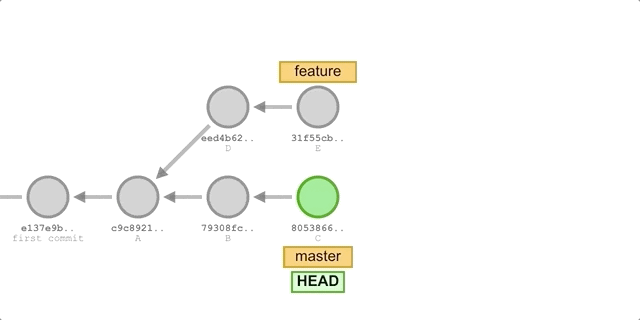
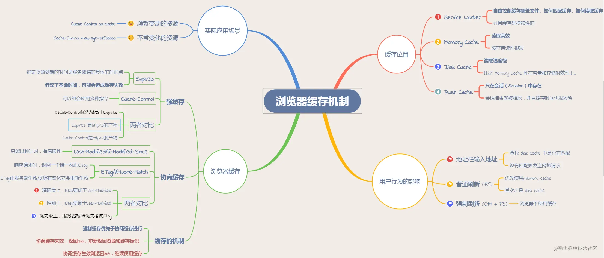

# 2023

## 组件库发布 t 环境构建失败

组件库项目这个版本使用 lerna 进行了分包，并将 father 版本从 1^ 升至了 4^  
发布时如下报错：

```txt
+ npm run build:test

> root@1.0.111 build:test
> cross-env CROSS_ENV='t-' npm run build:cdn && npm run docs:build && npm run copyUmd

npm WARN logfile Error: EACCES: permission denied, scandir '/root/.npm/_logs'
npm WARN logfile error cleaning log files [Error: EACCES: permission denied, scandir '/root/.npm/_logs'] {
npm WARN logfile errno: -13,
npm WARN logfile code: 'EACCES',
npm WARN logfile syscall: 'scandir',
npm WARN logfile path: '/root/.npm/_logs'
npm WARN logfile }

> root@1.0.111 build:cdn
> lerna run build

lerna notice cli v4.0.0
lerna info versioning independent
lerna info ci enabled
lerna info Executing command in 2 packages: "npm run build"
lerna ERR! npm run build exited 1 in '@myun/common-component'
lerna ERR! npm run build stdout:

> @myun/common-component@0.0.13 build
> father build

lerna ERR! npm run build stderr:
npm WARN logfile Error: EACCES: permission denied, scandir '/root/.npm/_logs'
npm WARN logfile error cleaning log files [Error: EACCES: permission denied, scandir '/root/.npm/_logs'] {
npm WARN logfile errno: -13,
npm WARN logfile code: 'EACCES',
npm WARN logfile syscall: 'scandir',
npm WARN logfile path: '/root/.npm/_logs'
npm WARN logfile }
node:internal/fs/utils:347
 throw err;
 ^

Error: EACCES: permission denied, mkdir '/home/jenkins/workspace/ask-sharelib-test/packages/common-component/node_modules/.cache/logger'
 at Object.mkdirSync (node:fs:1382:3)
 at Object.e.exports.makeDirSync (/home/jenkins/workspace/ask-sharelib-test/packages/common-component/node_modules/@umijs/utils/compiled/fs-extra/index.js:1:15306)
 at Object.<anonymous> (/home/jenkins/workspace/ask-sharelib-test/packages/common-component/node_modules/@umijs/utils/dist/logger.js:69:27)
 at Module._compile (/home/jenkins/workspace/ask-sharelib-test/node_modules/v8-compile-cache/v8-compile-cache.js:192:30)
 at Object.Module._extensions..js (node:internal/modules/cjs/loader:1250:10)
 at Module.load (node:internal/modules/cjs/loader:1074:32)
 at Function.Module._load (node:internal/modules/cjs/loader:909:12)
 at Module.require (node:internal/modules/cjs/loader:1098:19)
 at require (/home/jenkins/workspace/ask-sharelib-test/node_modules/v8-compile-cache/v8-compile-cache.js:159:20)
 at Object.<anonymous> (/home/jenkins/workspace/ask-sharelib-test/packages/common-component/node_modules/@umijs/utils/dist/index.js:109:22) {
 errno: -13,
 syscall: 'mkdir',
 code: 'EACCES',
 path: '/home/jenkins/workspace/ask-sharelib-test/packages/common-component/node_modules/.cache/logger'
}
npm ERR! Lifecycle script `build` failed with error:
npm ERR! Error: command failed
npm ERR! in workspace: @myun/common-component@0.0.13
npm ERR! at location: /home/jenkins/workspace/ask-sharelib-test/packages/common-component
lerna ERR! npm run build exited 1 in '@myun/common-component'
lerna WARN complete Waiting for 1 child process to exit. CTRL-C to exit immediately.

```

node_modules/.cache/logger 写入没有权限

- 首先考虑提升角色权限

```shell
yarn install --unsafe-perm --allow-root
```

- father build 为啥要往 node_modules/.cache 文件中写入 logger 文件  
  默认会在构建过程中将缓存文件放在该文件下，比如 logger 文件、webpack 缓存、mfsu 缓存等。
- 考虑阻止写入 logger 文件，也就是跳过日志
  在.fatherrc.ts 中配置以下,参考 webpack 配置：
  ```js
  import {} from '';
  export default defined({
    logger:{
      level:'silent';
    }
  })
  ```
  但是报错，logger 配置没有开放出来
- 还是考虑解决权限问题，最终由运维解决了

# 2022

## 命令行

查看端口占用

```shell
lsof -i tcp:80
kill pid
```

查看源、切换镜像

```shell
# npm查看当前源
npm get registry
# npm设置淘宝镜像源
npm config set registry http://registry.npm.taobao.org
# npm设置官方源
npm config set registry http://www.npmjs.org
```

## Git

### HEAD、branch

可以看做是一个指针

```shell
# 查看当前指向
cat .git/HEAD
ref: refs/heads/<branch name>  # 正常
cad0be9ceb89f474c39360c4de337d4a8194cab0  # 游离状态（指向某一次commit）detached
git checkout <branch name>  # 切换指向
```

**游离状态**  
缺点：在游离状态上的提交会新开一个匿名分支且提交是无法可见保存的，一旦切到别的分支，游离状态以后的提交就不可追溯了。  
解决：拉一个临时分支，存一下这些提交，再合并到目标分支

```shell
git branch # 查看当前分支状态
git branch <branch name>  # 新建分支
git branch -d <branch name>  # 删除分支

git status # 查看游离状态
# HEAD detached from <branch name>
```

### git log

用来查看 commit 记录

```log
commit 929e147f1a493a55f5662b0f106fd07d6a6c0553 (HEAD -> demo-test)
Author: name email
Date:   Fri Apr 22 21:48:10 2022 +0800
fix(题目): 修改

commit 011374651464fc2629018dd2d5ef7950d3361b7a   // commit-id
Merge: 90b6527 1ef08a0     // 当前commit-id 合入的commit-id
Author: name email
Date:   Fri Apr 22 21:46:46 2022 +0800
fix(题目): merge

commit 1ef08a0605bc842db7c2bb642288605e492b6851 (origin/framework, framework)
Author: name email
Date:   Fri Apr 22 21:44:42 2022 +0800
fix(题目): 修改引用

commit 90b6527a87dd1651cfc19e278f1cc73a0bfbb518
Author: name email
Date:   Fri Apr 22 21:42:12 2022 +0800
fix(题目): test
```

### 变基：merge 和 rebase

都用于分支合并，但两者原理不同

#### merge



#### rebase:

将当前分支的 commit 暂存，base 变更到目标 commit 之后再将暂存的 commit 合入

```shell
# 将base变为commit_id
git rebase commit_id  #会将HEAD指向指定的这次commit，此时HEAD处于游离状态
```


### revert 和 reset

#### revert

回退中间某个版本，会生成新的 commit 记录

```
git revert -n commitID
```

#### reset

将 HEAD 回指到指定的 commitID 版本

```bash
git reset --hard commitID

git reset --soft HEAD~1  # 不删除工作空间改动代码，撤销 commit，不撤销 git add .
git reset --hard HEAD~1  # 删除工作空间改动代码，撤销 commit，撤销 git add .
git reset --mixed HEAD~1 #默认 --mixed 不删除工作空间改动代码，撤销commit，并且撤销git add .
<!-- HEAD is now at 8de96b5  -->
```

## 正则

常用表单正则校验

```js
const rules = [
  {
    // pattern: /^[\u4e00-\u9fa5]{0,}$/, // 纯中文
    pattern: /^[^\x00-\xff]{0,}$/, // 中文包括中文标点符号
    message: "请输入中文",
  },
  {
    pattern: new RegExp("^[A-Za-z]+$"),
    message: "请输入字母",
  },
  {
    pattern: new RegExp("^[0-9]*$"),
    message: "请输入数字",
  },
  {
    pattern: /^1[3456789]\d{9}$/,
    message: "手机号格式有误",
  },
  {
    pattern: /^[a-zA-Z0-9_-]+@[a-zA-Z0-9_-]+(\.[a-zA-Z0-9_-]+)+$/,
    message: "邮箱格式有误",
  },
];
```

[正则校验工具](https://c.runoob.com/front-end/854/)

从 AcakeB 这个字符串中提取 cake:  
A.\*B

```js
const reg = /[^\${.*}]{1,}/; // A.*B  AB之间的字符，包括AB
const reg2 = /[^(?<=\${).+(?=})]{1,}/; // (?<=A).*(?=B)  AB之间的字符，不包括AB
const list = content?.match(reg); //获取所有匹配字符[]
```

## Chrome extension

消息通讯  
manifest.json  
默认读取 popup.html

## VsCode plugin

消息通讯

## PWA

#### 是什么？Progressive web apps

使用户在离网时页面保持在线时访问页面状态，交互？？

#### 实现方案

Web App Manifest、Service worker、Cache API、前端数据库、Notification API

#### serviceworker 是什么、特点、api、生命周期

利用 serviceworker 拦截请求，监听页面或请求，成功后将结果缓存，失败时取缓存  
navigator 对象注册 serviceworker  
addeventlistener fetch(请求)、install(静态文件)

```js
if (navigator.serviceWorker != null) {
  navigator.serviceWorker
    .register("sw.js", { scope: "" })
    .then(function (registration) {
      console.log("Registered events at scope: ", registration.scope);
    });
}
```

> serviceWorker 作用范围是 sw.js 所在目录一下的所有路径，设置 scope 必须是 sw.js 所在目录的子目录

使用场景：  
 期望在各种项目中注册 sw 用于拦截同一个接口，请求优先，每次请求成功更新缓存，请求失败从缓存中取上次的结果  
 [最终实现](/pages/sw.md)  
 为什么要用 sw？可以拦截任意该接口地址的请求，不受限于发送请求的方式  
 遇到的问题：  
 单页面项目在 global 中注册之后没有立刻生效， 切换页面也没生效，手动刷新才生效  
 解决：

```js
self.addEventListener("activate", (event) => {
  event.waitUntil(clients.claim());
});
// service worker 被初始注册时，页面在下次加载之前不会使用它
// claim() 方法会使之立即生效

self.addEventListener("install", function (event) {
  self.skipWaiting();
  // 个人理解：更新 sw之后立即生效
});
```

### 缓存 cache


[浏览器缓存](https://juejin.cn/post/6844903799195172877)  
CacheStorage 本质是 ServiceWorkerCacheStorage 对象 ，同一域名只会有一个 ServiceWorkerCacheStorage  
Cache 的资源是无法跨域共享的。  
由于 Service Worker 相关缓存的底层存储都使用了系统的文件系统（File System），而文件系统一般是不支持多进程访问的，当统一域名下有两个不同的 Service Worker 是无法同时对同一资源进行操作的。  
Cache 本质是 ServiceWorkerCache，当 Service Worker 从 Cache 拿不到资源时，就会去 http cache 查找，找不到才去请求网络。  
用于存储 response、request 对象  
除非手动清除、永久有效  
键值对存储，便于覆盖

```js
caches.open().then((cache) => {
  cache.match();
  cache.put();
  res.clone().json();
});
```

## react 中使用 iconfont

参考[官方文档](https://v1.pro.ant.design/docs/biz-icon-cn)

#### symbol 方案

缺点：不可通过 color 修改图标颜色

- 添加 script 引用  
  antd pro 脚手架搭建的项目，在 defaultSetting 中配置 iconfontUrl://at.alicdn.com/t/xxx.js
- global.less 中添加

```css
.icon {
  width: 1em;
  height: 1em;
  vertical-align: -0.15em;
  fill: currentColor;
  overflow: hidden;
}
```

- 页面中应用

```html
<svg class="icon" aria-hidden="true">
  <use xlink:href="#icon-xxx"></use>
</svg>
```

#### font-class 方案

- 添加 css 文件引用  
  可添加 link 标签或在 global.less 中@import '//at.alicdn.com/t/xxx.css'
- 页面中引用

```html
<i class="iconfont icon-xxx"></i>
```

<!--
## 实现在浏览器中 import 内联 JS 模块

使 ES Modules 能 import 自身 HTML 文件里的模块。
用到 blob 对象，将一段 JavaScript 文本创建成 Blob 对象，并返回 Blob 对象的 URL。

```js
function getBlobURL(module) {
  const jsCode = module.innerHTML;
  const blob = new Blob([jsCode], { type: "text/javascript" });
  const blobURL = URL.createObjectURL(blob);
  return blobURL;
}

<script type="inline-module"></script>;
``` -->

## braft-edit

自动获取焦点

```js
const editorRef = useRef(null);
<BraftEditor draftProps={{ ref: editorRef }}></BraftEditor>;
editorRef.current?.focus();
```

## 重定向

重定向的方法（按优先顺序触发）：

1. http 协议的重定向机制  
   301 永久 302 暂时 304 特殊
2. http-equiv refresh

```html
<head>
  <meta http-equiv="Refresh" content="0; URL=http://example.com/" />
  <!-- 0s 后跳转 -->
</head>
```

3. window.location = "http://example.com/";

## 数据结构

### 数组和列表

**列表**中的元素在内存中可能彼此相邻，也可能不相邻。比如列表的另一种实现方式——链表，它的元素在内存中则不一定是连续的。  
列表常见形式：数组、栈和队列。  
**数组**有序，有索引，其元素在内存中是连续存储的，且每个元素占用相同大小的内存。

#### 数组

计算机会在内存中为其申请一段**连续**的空间，并且会记下索引为 0 处的内存地址。

- 读取元素
  通过计算内存地址访问元素，时间复杂度是常数级别，为 O(1)。
- 查找元素
  从 0 开始逐步查找，时间复杂度为 O(N)。
- 插入元素
  插入处及以后的元素向后移动一个索引，频繁插入建议用链表处理。
- 删除元素
  删除处及以后的元素向前移动一个索引。当数组的长度为 n 时，最坏情况下，n - 1 为移动其余元素的步骤数。删除操作具有线性时间复杂度，即时间复杂度为 O(N)，N 为数组的长度。

## 学习

[React 技术揭秘](https://react.iamkasong.com/)  
[React 进阶实践指南](https://juejin.cn/book/6945998773818490884/section/6951186955321376775)  
[深入理解 TypeScript](https://jkchao.github.io/typescript-book-chinese/)  
[JS 手写题](https://juejin.cn/post/6946022649768181774)
[八股文](https://juejin.cn/post/7016593221815910408)

<!-- ## 重学前端

### JS

避免 undefined 被重新定义值，建议使用 void 0;代替
检验 0.1+0.2===0.3 的正确方法：

```js
console.log(Math.abs(0.1 + 0.2 - 0.3) <= Number.EPSILON);
``` -->

## Docker

创建 image 文件

```shell
docker image build -t gemstone:1.3.0 .
```

拉取 image

```shell
docker  image pull  library/hello-world
```

查看文件

```shell
docker image ls
```

运行 image

```shell
docker container run hello-world
```

> container run 会自动拉取

终止容器

```shell
docker container kill [containID]
```

列出本机正在运行的容器

```shell
$ docker container ls
```

列出本机所有容器，包括终止运行的容器

```shell
$ docker container ls --all
```

删除容器

```shell
docker container rm ID
```
