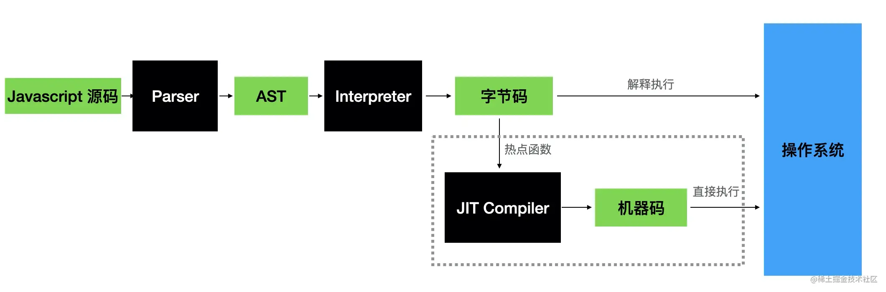
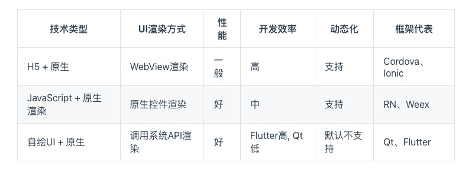
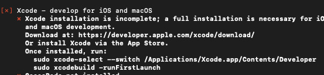
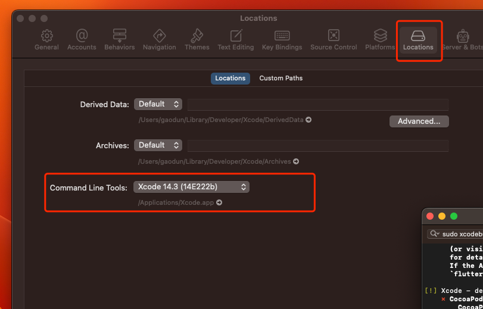

# Flutter

## 初识 flutter

Flutter 是 Google 发布的一个用于创建跨平台、高性能移动应用的框架。拥有自己的 UI 系统布局，支持 iOS、Android、Web、Windows、macOS、Linux、Fuchsia（Google 新的自研操作系统）等众多平台。  
Flutter 的 Release 包默认是使用 Dart AOT 模式编译的，所以不支持动态化，但 Dart 还有 JIT 或 snapshot 运行方式，这些模式都是支持动态化的。

> 执行之前是否需要编译  
> AOT（Ahead of time）: 提前编译，静态编译，被提前编译为机器码（或中间字节码） C/C++  
> JIT（Just-in-time）: 实时编译，解释执行，运行时编译为机器码 JS/python
> 

**优点：**

1. 性能高。自绘引擎直接调用系统 API 绘制 UI，性能和原生接近
2. 组件库易维护，UI 一致性高



### 框架结构

- 框架层: UI、渲染、widgets
- 引擎层: Skia 绘图引擎、Dart 运行时、文字排版引擎等
- 嵌入层: 将 Flutter 引擎 ”安装“ 到特定平台上。

## 安装 flutter、配置环境变量

[官方文档](https://flutter.cn/docs/get-started/install)

检测环境是否完整：

```
flutter doctor
```

可能会有如下问题：

1. Xcode 未授权
   
   解决： 运行 sudo xcodebuild -license
2. xcode-select: error: tool 'xcodebuild' requires Xcode, but active developer xxxxx is a command line tools instance
   解决： 修改 xcode 配置
   
3. cocoapods 没安装
   运行 sudo gem install cocoapods

#### 全局变量（mac）

zsh: command not found: flutter

```bash
open ~/.bash_profile
#把下面这行写入进去
export PATH=/Users/USERNAME/development/flutter/bin:$PATH  #你的flutter下载路径
#然后执行
source ~/.bash_profile
```

如果写在 bash_profile 中，每次终端重启都要 source 一下，所以建议把所有环境变量配在.zshrc 中  
zsh:  
将 bash_profile 中的配置 copy 到 ~/.zshrc

```
source ~/.zshrc
```

## 创建并运行一个 flutter 项目

项目命名，不能用-，用\_代替

```bash
 flutter create my_app
 cd my_app
 open -a Simulator  #mac 启动模拟器
 flutter run
#  flutter run --release  发布模式
```

### 编辑器插件

vscode:

- Flutter （格式化，自动补全等）
- Flutter Widget Wrap （插入 widget）
- Flutter Widget Snippets （快捷代码块）

### 热更新、调试

热更新：

1. 在 flutter run 时输入 r
2. 支持 flutter IDE 的编辑器用热更新启动
3. vscode debugger 模式

调试：  
command shift p 执行

> Dart: Open DevTools

### 目录结构

`android、ios` 预留的原生代码目录(发布相关配置，eg:启动页图片等)  
`lib src`  
`assets` 静态文件  
`test` 测试代码  
`pubspec.yaml` 配置依赖项文件

- [Pub](https://pub.dev/) Dart Packages 仓库  
  加依赖后需要 flutter pub get、重启项目

- 本地包、git 包

flutter 版本和 dart 版本是一一对应的。参考[sdk 列表](https://flutter.cn/docs/development/tools/sdk/releases)
项目 dart 运行环境要求和本地 flutter 版本不一致可能会导致某些依赖包使用不了。

```yaml
# dart运行环境要求
environment:
  sdk: ">=2.19.2 <3.0.0"

dependencies:
	 pkg1:
        path: ../../code/pkg1

dependencies:
  package1:
    git:
      url: git://github.com/flutter/packages.git
      path: packages/package1
```

## Dart

Dart 强类型语言，同时借鉴了 Java 和 JavaScript。[> 如何看待 Dart](https://www.zhihu.com/question/25058236/answer/2795438635)

类型：

1. Numbers (num, int, double)  
   

```js
let rounded = Math.round(2.5);
```

```dart
var rounded = 2.5.round();
```

2. Strings (String)  
   转义,模版字符串，字符串换行，是否相等==

```dart
 final singleQuotes = 'I\'m learning Dart'; // I'm learning Dart

var food = 'bread';
var str = 'I eat $food'; // I eat bread.   omit the curly braces when the expression uses a single identifie
var str = 'I eat ${food}'; // I eat bread

// 字符串换行，自动拼接相邻的字符串，或用三引号
final s1 = 'String '
    'concatenation'
    " even works over line breaks.";

final s2 = '''
You can create
multiline strings like this one.
''';

final s3 = """
This is also a
multiline string.""";

```

3. Booleans (bool)
4. Lists (List, also known as arrays)
5. Sets (Set)
6. Maps (Map)
7. Symbols (Symbol)
8. The value null (Null)

==和===

```dart
var a = 2;
var b = 1 + 1;

print(a == b); // Prints true.
print(identical(a, b)); // Prints true; only one "2" object exists.  the same object
```

#### 变量

- var
  自动推断类型为初次赋值的类型
- dynamic, object
  可任意类型重新赋值;  
  object 声明的变量只能使用`Object`的属性方法。
- final, const

```dart
String name;
var name = 'bob';
var name;  //任意类型

final String name;
name = 'Bob'
print(name);

var foo = const [];  //const 编译时常量
const baz = []; // Equivalent to `const []`
// TODO:
// JavaScript does allow you to modify a const object’s fields, but Dart does not.
```

- 空安全

```dart
int i = 8; //默认为不可空，必须在定义时初始化。
int? j; // 定义为可空类型，对于可空变量，我们在使用前必须判空。
// 如果我们预期变量不能为空，但在定义时不能确定其初始值，则可以加上late关键字，
// 表示会稍后初始化，但是在正式使用它之前必须得保证初始化过了，否则会报错
late int k;
k=9;

class Test{
 int? i;
 Function? fun;
 say(){
   if(i!=null) {
     print(i! * 8); //因为已经判过空，所以能走到这 i 必不为null，如果没有显式申明，则 IDE 会报错
   }
   if(fun!=null){
     fun!(); // 同上
   }
 }
}
```

#### 函数

根据返回值定义函数类型；  
无自动类型推断，没有声明的默认为 dynamic 类型

```dart
bool isNoble(int atomicNumber) {
  return _nobleGases[atomicNumber] != null;
}

bool isNoble (int atomicNumber)=> true ;

String say(String from, String msg, [String? device]) {
  var result = '$from says $msg';
  if (device != null) {
    result = '$result with a $device';
  }
  return result;
}

//设置[bold]和[hidden]标志
void enableFlags({bool bold, bool hidden}) {
    // ...
}
enableFlags(bold: true, hidden: false);
```

#### Mixin

```dart
class Person {
  say() {
    print('say');
  }
}

mixin Eat {
  eat() {
    print('eat');
  }
}

mixin Walk {
  walk() {
    print('walk');
  }
}

mixin Code {
  code() {
    print('key');
  }
}

class Dog with Eat, Walk{}
class Man extends Person with Eat, Walk, Code{}
```

#### 异步

1. Future (Promise)  
   `Future.then`  
   `Future.catchError`
   `Future.whenComplete`  
   `Future.wait`  
   `async\await`

```dart
Future<String> httpResponseBody = func();

httpResponseBody
  .then((String value) {print('Future resolved to a value: $value');})
  .then(...)
  .catchError((err) {
    print(
      'Future encountered an error before resolving.'
    );
  });

String str = 'String Value';
Future<String> strFuture = Future<String>.value(str);
```

2. stream

### 网络请求

1. HttpClient
2. http 官方提供的网络请求类
3. dio
   强大的 Dart Http 请求库，支持 Restful API、FormData、拦截器、请求取消、Cookie 管理、文件上传/下载、超时、自定义适配器等...

## Widgets

Flutter 中万物皆为 Widget。  
和 React 一样，同样遵循 UI = fn(state)， state 可以直接赋值，但只能通过 setState 更新渲染。功能单一原则。

- StatelessWidget

```dart
class StatelessText extends StatelessWidget{
  @override
  Widget build(BuildContext context) {
    return Text("Stateless");
  }
}
```

- StatefullWidget
  名称开头的 _字符使得该类对 .dart 文件是私有的。  
  如果你需要在 .dart 文件之外引用此类，请不要使用 _ 前缀。  
  类中可以通过使用 widget.{变量名称} 来访问被存储在 MyStatefulWidget 中的任何变量。在该示例中为：widget.color。

基础 widgets:

- Text
- Row,Column  
  flex widgets
- Stack  
  子 widget：Positioned widget 相对于 stack 上右下左
- Container
  可用 BoxDecoration 装饰,背景边框阴影

```dart
Widget build(BuildContext context){
  return Container(
    decoration: BoxDecoration(),
    height:60,
    padding:10,
    child:Row(
      children:[]
    )
  )
}
```

- FutureBuilder 和 StreamBuilder
  异步渲染

[Material Components Widgets](https://flutter.cn/docs/development/ui/widgets/material)

> 学习参考  
> [flutter 实战](https://book.flutterchina.club/)  
> [flutter widgets 文档](https://api.flutter-io.cn/flutter/widgets/AbsorbPointer-class.html)  
> [flutter 官网](https://flutter.cn/docs/get-started/install)  
> [Dart 官网](https://dart.cn/)
