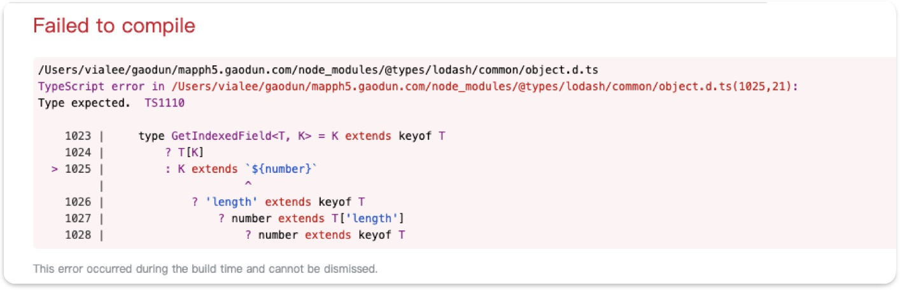
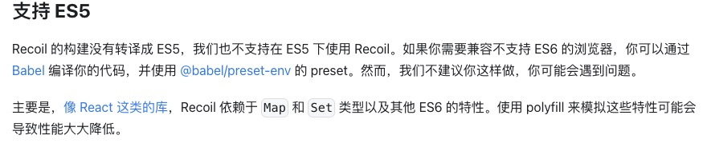

<!-- ### install 报错
// error An unexpected error occurred: "https://r2.cnpmjs.org/rc-menu/-/rc-menu-9.1.1.tgz: unable to verify the first certificate".
 -->

## 2023

<log />
### 7/25 组件库发版 缓存问题

背景：业务组件库打包成 umd 并放在 oss 服务器上存储，工作台项目通过 cdn 获取该打包结果，并用其提供的业务组件配置页面保存后发布该页面，在用户端即可访问配置的页面。  
问题：get 请求缓存。组件库发版后，用户访问的页面组件并没有更新。  
解决：因此目前解决方案是在配置页面时请求 umd 地址后加一个版本号，每次都得手动修改，从而使用户端发送最新版本的请求。  
问题：cdn 缓存。cdn 接收到客户端发送来的请求，如果该版本本地已经存在，则直接返回，如果不存在，则请求存储服务器获取最新的资源。 除此之外 cdn 也会定期拉取。

### 7/18 给高度 auto 的 dom 动画过渡

好奇 ant-collapse 的展开收起动画效果怎么做的，内容自适应

```css
div {
  max-height: 0;
  transition: 1s;
}
.wrap :hover div {
  max-height: 800px; /*大概的值，需要超过元素高度*/
}
```

### 7/10 浏览器非激活状态 setInterval、setTimeout 会停止运行

浏览器优化策略，非激活状态的

1.使用 worker 计算

```js
// main.js
initCountWorker(){
  const self = this;
        if (window.Worker) {
            var worker = new Worker(`/public/src/js/utils/count-worker.js`);
            self.state.countWorker = worker;
            worker.postMessage(initTime);
            worker.onmessage = function (e) {
                self.state.timeCount = e.data * 1000;
                const countdown = getCountdown(e.data * 1000);
                const { hour, minute, second } = countdown;
                $('.tiku-detail-time').html(`倒计时：${hour} : ${minute} : ${second}`);
                if (e.data === 0) {
                    if (!this.state.isUpload) {
                        layer.msg('文件正在上传，请稍后提交');
                        return;
                    }

                    _this.submitExam();
                }
            };
        }
}

// worker.js
console.log("count-worker 启动");
const self = this;
onmessage = function (e) {
  let initTime = e.data;
  console.log("初始剩余时间", initTime);
  const T = setInterval(() => {
    self.postMessage(--initTime);
    if (initTime <= 0) {
      clearInterval(T);
      self.close();
    }
  }, 1000);
};
```

2. window.onFocus 切回来重新调接口获取最新时间
   window.onFocus 小屏切换也会触发，只要页面被聚焦

### 6/15 源码 map 文件请求混杂报错

和打包开启源文件有关

```
url = /web/exam/answer_sheet/runtime-header.83184b99.js.map
```

### 5/30 css 梯形

```css
.trapezoid {
  width: 200px;
  height: 100px;
  background-color: #f00;
  clip-path: polygon(0 0, 100% 0, 80% 100%, 20% 100%);
}
```

clip-path polygon 的值是左上角顺时针四个角，横纵坐标的值，收尾点的位置需要重合，中间围起来的区域就是最终图形。有个缺点：这样的图形背景色是取反的，因为是 clip。

<!-- ### 05/30 CSS 最后一个类元素 -->

### 05/29 根据图片主色调设置 dom 背景色

UI 说 文字背景色要根据上方图片主色调自动设置  
查阅了一圈发现两个办法：

- JS
  将图片放入 canvas 面板中，使用 canvas cxt 的 getImageData()获取图片色码值，是个很长的数组
  然后遍历数组，对色码进行统计，拿到最多次数的色码值
- CSS
  使用高斯模糊&放大
  ```css
  div {
    background-image: url("图片");
    transform: scale(60);
    filter: blur(50px);
  }
  ```
  两种都有缺点：
  1. 需要处理数据多的情况 JS 遍历的数组多且长，消耗性能，也有优化将图片缩小后拿缩略图统计，但个人还是不喜欢 JS 处理
  2. 将 dom 放大 60 倍也可能有些问题，且实际效果没有 JS 统计精准，但目前使用的是该方法

### 05/17 服务器被挖

同事发现他的腾讯云服务器运行超级慢，啥也没干 CPU 占满了，然后使用

```shell
ps -aux       #所有用户所有进程
ps -u root    #root用户进程
top -u root   #root用户进程
kill -9 PID   #终止进程
```

查看进程情况，发现有一个占用了 130%CPU，来自 /tmp/kdevtmpfsi  
问 ChatGPT，发现是个恶意的挖矿程序，给出了以下阻止方法：

```shell
find / -iname kdevtmpfsi* -exec rm -fv {} \;  #删除所有kdevtmpfsi相关程序
find / -iname kinsing* -exec rm -fv {} \;  #删除所有kdevtmpfsi相关程序
```

根据删除的文件地址发现是在 docker 镜像里，可能是 docker 镜像没有做安全设置。  
决定写一个脚本监控如果发现 kdevtmpfsi 程序就执行终止。

```shell
a=$(docker ps | grep kdevtmpfsi* | awk '{print $1,$NF}')  #列出所有运行中的容器 | 按名称过滤 | 打印ID 和 名称 并赋给a
echo $a #输出a
```

根据 docker 镜像管理工具显示，是镜像运行过程中执行了一段脚本，且采用的静默模式。

### 05/17 本地资源模拟测试环境资源

1. 将本地服务转 https，端口使用 443 默认端口，避免端口不一致导致的跨域问题.

```shell
local-ssl-proxy --source 443 --target 8080
```

2. 还报跨域

```shell
http-server --cors # 将服务启用为允许所有源
```

3. 还报错 net::ERR_CERT_AUTHORITY_INVALID  
   原因是：浏览器无法验证代理的 https 的 SSL  
   直接访问该地址，提示安全，点击继续访问后，不报错了。
4. 访问默认端口，Request failed to proxy: ECONNREFUSED，原因也是 3

### 05/15 组件库发布 t 环境构建失败

从 gitlab 构建日志分析得出，是写入日志时没有权限。[详情](/pages/blog.html)

### 05/10 离开页面埋点

写在 beforeUnload 回调里，取消默认事件离开页面会提示用户是否确认离开

```js
window.addEventListener("beforeunload", (event) => {
  // Cancel the event as stated by the standard.
  event.preventDefault();
  // Chrome requires returnValue to be set.
  event.returnValue = "";
});
```

### 04/20 协助 App 解决问题

#### 内嵌 H5 页面获取 app 的 token，首次未获取到

安卓环境，清除缓存后重新登录 App，进入 h5 页面，未获取到 token，第二次进入 h5 页面正常。

- h5 页面 PC、H5、App 共用，需要区分当前环境
- token 有三种情况、H5 自身登录、PC 跳转 URL 带入、App 登录获取
- 区分是否首次从 App 进入，决定是否要获取 App token

#### app 内退出登录需要跳转到 App 登录页

- 区分环境
- 跳转 URL Schema

### 04/19 egg 混合 react 页面项目

老项目采用 egg、jquery 开发、部分页面采用 react 重构、目前方案是将新页面放在一个 react 项目内打包放在老项目里，路由直接读取打包后的产物，问题：

1. 统一导航栏，新老页面都是用 react 中的导航栏  
    将导航栏单独打包输出，在老页面读取产物

   ```js
   //webpack 配置
   webpackConfig.entry = {
     header: path.resolve(__dirname, "./src/header.tsx"),
   };
   plugins: [
     new htmlWebpackPlugin({
       filename: "header.html",
       chunks: ["header"],
       template: path.resolve(__dirname, "./public/header.html"),
     }),
   ];
   ```

2. 需要区分环境读取对应的 build 包，全局变量\_system_env 通过中间件统一传入

   ```ejs
   <%- include('../../public/build-'+_system_env+'/header.html') -%>
   ```

3. antd 全局样式污染问题  
   没有发现好的解决办法、暂时通过覆盖解决

### 04/14 Error TS1110 Build: Type expected



ts 版本过低,缺少部分类型定义,升级

```
"typescript": "^3.7.5"
"typescript": "4.2.4",
```

### 02/21 系统升级为 macOS Ventura

拉 git 项目报错， no matching host key type found.  
解决：  
修改~/.ssh/config （没有的话需要新建）文件，添加如下两行配置：

`HostkeyAlgorithms +ssh-rsa`  
`PubkeyAcceptedAlgorithms +ssh-rsa`

<!-- ### 03/09 组件库打包优化

包体积优化： -->

<!-- ### 视频水印 -->
<!-- canvas 定位文字，生成图片，放在video同级，用mutationObserve监听dom变化、属性变化，水印被删除时再生成一张 -->

### 02/02 taro 项目编译 h5 白屏

1. 部分安卓手机 UC 浏览器、苹果 safri 浏览器页面白屏；
   本地启动真机访问无异常  
   本地编译 h5 后使用真机访问白屏

解决过程：  
 使用 vconsole，CDN 方式引入，看到白屏页面报错：  
'Uncaught SyntaxError:'super' keyword unexpected here'  
是项目中使用的 Recoil 兼容性问题，查看官网发现不支持 ES5，得另外使用 babel 编译。  
将 Recoil 以 CDN 方式引入得以解决。暂未找到其他更好的办法。



2. 使用 Taro.redirectTo,reLaunch 跳转，路由变化但页面白屏
   版本升级

3. 编译报错，sass 中不支持/运算  
   打补丁，单独处理

## 2022

### eslint 报错 忽略

1. /_ eslint-disable _/
2. 在.eslintrc.js>rules 添加@typescript-eslint/no-var-requires ，如下：
   rules: {
   "@typescript-eslint/no-var-requires": 0,
   }

### 下载文件 文件过大 报错

```js
export const download = (url, name) => {
  const xhr = new XMLHttpRequest();
  xhr.open("GET", url, true);
  // 以二进制文件修改
  xhr.responseType = "blob";
  xhr.onload = () => {
    const url = window.URL.createObjectURL(xhr.response);
    var a = document.createElement("a"); //新建a标签
    a.download = name || "file"; //下载下来的文件名
    a.href = url;
    var event = new MouseEvent("click");
    a.dispatchEvent(event);
  };
  xhr.onreadystatechange = function () {
    // 下载时readyState===3，一次请求一直被调用
    console.log(xhr.readyState);
  };
  //  中途 xhr.abort() xhr.readyState===0 且 xhr.status===0
  xhr.send();
};
```

readyState 属性表示 Ajax 请求的当前状态。
0 代表未初始化。 还没有调用 open 方法
1 代表正在加载。 open 方法已被调用，但 send 方法还没有被调用
2 代表已加载完毕。send 已被调用。请求已经开始
3 代表交互中。服务器正在发送响应
4 代表完成。响应发送完毕

场景：某些电脑(同一用户)，下载同样的文件，从页面点击下载报错，浏览器贴链接下载正常。
报错：

1. Get net::ERR_CONTENT_LENGTH_MISMATCH 200 (OK)
   Status Code: 200 OK
   network status (failed)net::ERR_CONTENT_LENGTH_MISMATCH
2. (failed)net::ERR_FAILED 200 (OK) network 中的 sourceSize 为 0  
   请求异常中断导致没有下载

### chrome 点击浏览器回退 页面不刷新

chrome 的 back/forward cache 机制

<!--
### umi request 做了哪些处理

### 微前端 通讯 -->
