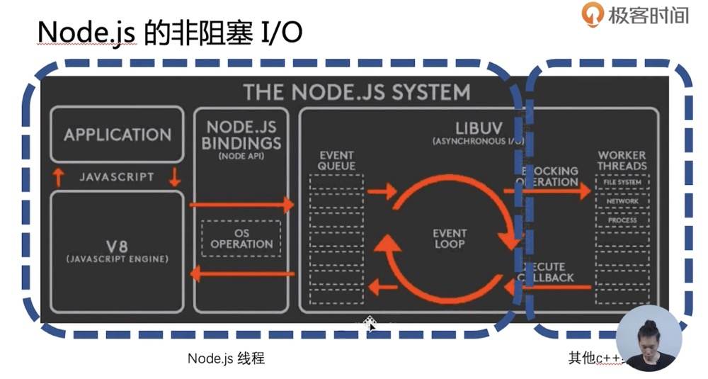

## Node 开发实践

### node 基础架构

三部分：Libuv(c 语言),V8(JS 引擎),C++  
单线程+事件驱动+非阻塞 IO  
单线程：不推荐使用阻塞类型 api  
事件驱动：发布订阅，通知，事件触发类型：水平触发、边缘触发
接收 -> 线程池(完成后通知给生产者\主线程) -> 生产者(生产一个任务到事件循环中) -> 消费者 -> 响应回调  
例如： OS 相关 api:
用户调用 os.xxx ---> node 调用 V8 的对应方法 ---> V8 底层读取，由 c++转化为 js --->return 给 node ---> return 给用户

#### 事件循环

是一个循环，无任务时处于阻塞状态，进入一个 promise 中等待，一旦有任务再被唤起

### Libuv 分两部分 handle、request

### commonJS 模块规范

CommonJS module.exports | require()
ESM export | import

1. webpack 用来讲 js 文件模块化，每个文件即一个函数，又独立的作用域
2. export 默认以对象输出
   js 内和外部是同一引用 ---> 可在外部 require 并附加属性上去
   module.exports = 指定方法或对象 可覆盖默认 export 对象

import dayjs from 'dayjs'; 报错  
TypeError: dayjs_1.default is not a function  
https://github.com/iamkun/dayjs/issues/475

### 事件循环

阻塞和非阻塞区别：系统在输入到输出期间能否接受其他输入。


### 监听输入

### EventEmitter 观察者模式，抛事件

有无订阅都能继续，不受被通知者影响。

```js
class NewEventListener extends EventEmitter {
  constructor() {
    super();
    setInterval(() => {
      this.emit("newSomething", { sth: "some attribution" });
    }, 3000);
  }
}

const newListener = new NewEventListener();

newListener.addListener("newSomething", (res) => {
  console.log("yeah~", res); // {sth:'some attribution'}
});
```

### 回调 callback

node 中 try catch  
每个事件循环都是新的调用栈

```js
function interview(callback){
  setTimeout(()=>{
    // 新的调用栈
    if(Math.random()<0.1){
      callback('success');
    } else {
      // throw new Error('fail');   // 所以原上层调用栈，catch不到
      callback(new Error('fail');)// 所以需要callback 抛回去
    }
  }, 500)
}

// try{
  interview(function(err,res){
    // node 规范异步方法回调第一个参数为 Error
    if(err){
      console.log('cry',e);
    }
    console.log('smile');
  })
// } catch (e) {
//   console.log('cry',e);
// }
```

弊端：回调地狱，异步并发  
异步并发解决：asyncjs,thunk

### express

1. 提供了路由、http 重定向等功能
   app.get('路由',function(req,res,next){})
2. 同步中间件 符合洋葱模型，但是 next()是阻塞的，无 context

### koa

1. 中间件 异步，支持 async await，提供 context
2. 不提供路由，用户自定义路由中间件处理

### RPC 调用

服务器之间的通讯，和 ajax 区别：

1. 不一定使用 DNS 进行寻址  
   ajax:使用 DNS 寻址  
   RPC：使用特有服务进行寻址
2. 应用层协议一般不使用 http，使用二进制协议  
   二进制协议特点：[0110010101001010111110011]二进制流，不同位数代表不同字段

- 数据包体积更小
- 更快解码速率

3. 基于 TCP 或 UDP 协议  
   TCP 通讯方式：单工通讯、半双工通讯（轮番单工）、全双工通讯

#### Buffer

```js
const buf1 = Buffer.from("sadf" | [1, 2, 3]); //创建buffer

const buf2 = Buffer.alloc(20); //指定长度创建空buffer

buf2.writeInt8(数字, 偏移量); //将数字以8位写入buffer中，用于编码一个二进制包

// protocal-buffers 配置协议文件，将传入的JSON数据自动生成、解析二进制包
```

#### net 搭建多路复用的 RPC 通道

```js
// ==========================单工通信============================
// 单方写入
// ----------------server.js
const net = require('net');

const server = net.createServer((socket)=>{
  socket.on('data',function(buffer){
    console.log(buffer,buffer.toString())
  })
})
server.listen(4000)

// ----------------client.js
const net = require('net');
const socket = new net.Socket({})
socket.connect({
  host:'127.0.0.1';
  port:'4000'
})
socket.write('hello')

// ==========================半双工通信============================
// 来回通讯
// ----------------server.js
const net = require('net');

const data = {
  111:'01: 春天',
  222:'02: 夏天',
  333:'03: 秋天',
  444:'04: 冬天',
  555:'05: 春天',
}

const server = net.createServer((socket)=>{
  socket.on('data',function(buffer){
    const id = buffer.readInt16BE()
    buffer.write(buffer.from(data[id]))  //返回对应的值
  })
})
server.listen(4000)

// ----------------client.js
const net = require('net');
const socket = new net.Socket({})
socket.connect({
  host:'127.0.0.1';
  port:'4000'
})
socket.write(111)

// ==========================全双工通信============================
/*
可能存在的问题
1. 请求响应不对应
需要手动拼接一个字段标记包号
2. 同时发送很多包 TCP会将数据合并发送(优化机制)，造成粘包
需要手动分割，标记包长
3. 网络错误处理
*/


```

### api

**path**  
path.resolve() 从根目录拼接（绝对路径）
path.join() 单纯拼接
