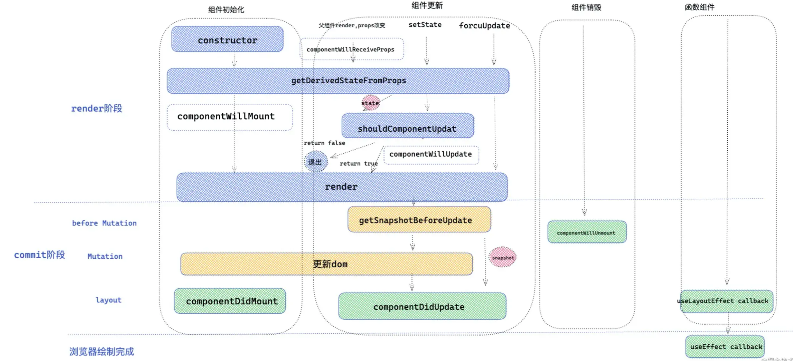

# React

## Jsx

经过 babel 编译-->React.createElement(react 17 不需要显式导入 react)交由 React 处理、渲染。  
React DOM 在渲染所有输入内容之前，默认会进行转义，这样可以有效地防止 XSS（cross-site-scripting, 跨站脚本）攻击。  
可通过@babel/plugin-transform-react-jsx (opens new window)插件显式告诉 Babel 编译时需要将 JSX 编译为什么函数的调用（默认为 React.createElement）。

### React.createElement

createElement 方法会创建并返回一个对象，存放组件的信息，其$$typeof 为'REACT_ELEMENT_TYPE'，react.element 类型  
React.isValidElement()检测是否为合法组件

```js
export function isValidElement(object) {
  return (
    typeof object === "object" &&
    object !== null &&
    object.$$typeof === REACT_ELEMENT_TYPE
  );
}
```

<!--
### React Component

区分函数组件和类组件：
1. XXX.prototype.isReactComponent 是否存在，存在————类组件，不存在————函数组件
```js
if (ClassComponent.prototype.isReactComponent) {
  console.log("ClassComponent是类组件");
} else {
  console.log("ClassComponent函数式组件");
}
```
2. instanceof React.Component true————类组件，false————函数组件

```js
const clas = new ClassComponent();
console.log(`ClassComponent is Class  ${clas instanceof React.Component}`); //true

const func = new FunctionComponent();
console.log(`FunctionComponent is Class  ${func instanceof React.Component}`); //false
``` -->

## Children 相关 API

React.isValidElement(item) 判断是否 react element
React.Children.only 子节点是否单一
React.Children.forEach 遍历子节点
React.Children.forEach = React.Children.toArray + Array.prototype.forEach

> 通常与 React.cloneElement()一起使用操作 children,注入新的属性

<!-- ## 单项数据流

1. 组件间 props 是只读的，自顶向下，流向单一。
2. 数据改变驱动视图改变，而视图变化需要手动更新状态 -->

## 生命周期


错误处理：  
static getDerivedStateFromError(error) render 阶段，不可有副作用  
componentDidCatch() commit 阶段，可有副作用  
componentDidUpdate 与 useEffect 无依赖类似，每一次执行函数组件都会执行

<!-- ### getSnapshotBeforeUpdate

获取更新前 DOM 信息的最佳时期，可进行和 dom 相关的计算
return 一个快照作为 componentDidUpdate 的第三个参数 -->

### useEffect 和 useLayoutEffect 和 componentDidMount

useEffect 在 commit 阶段的 layout 子阶段结束后异步调用（渲染后调用）  
componentDidMount 和 useLayoutEffect：commit 的 layout 阶段同步调用（渲染前调用）

## 15vs16

### 更新过程

15：同步不可中断

- Reconciler（协调器）—— 负责找出变化的组件
- Renderer（渲染器）—— 渲染更新。递归处理虚拟 DOM。

16：异步可中断，优先级调度

- Scheduler（调度器）—— 调度任务的优先级，高优任务优先进入 Reconciler  
  模拟 requestIdleCallback。  
  不直接使用的原因：浏览器兼容性；触发频率不稳定（切换 tab）。
- Reconciler（协调器）—— 负责找出变化的组件  
  调用 shouldYield，判断是否有剩余时间，用 EffectTag 标记有改变的节点
- Renderer（渲染器）—— 渲染更新

## Fiber

### fiber 节点——动态工作单元

ReactElement —— reconciler ——> fiber  
14 中 fiber 类型，关系有三种：child，return，sibling

```js
export const FunctionComponent = 0; // 函数组件
export const ClassComponent = 1; // 类组件
export const IndeterminateComponent = 2; // 初始化的时候不知道是函数组件还是类组件
export const HostRoot = 3; // Root Fiber 可以理解为根元素 ， 通过reactDom.render()产生的根元素
export const HostPortal = 4; // 对应  ReactDOM.createPortal 产生的 Portal
export const HostComponent = 5; // dom 元素 比如 <div>
export const HostText = 6; // 文本节点
export const Fragment = 7; // 对应 <React.Fragment>
export const Mode = 8; // 对应 <React.StrictMode>
export const ContextConsumer = 9; // 对应 <Context.Consumer>
export const ContextProvider = 10; // 对应 <Context.Provider>
export const ForwardRef = 11; // 对应 React.ForwardRef
export const Profiler = 12; // 对应 <Profiler/ >
export const SuspenseComponent = 13; // 对应 <Suspense>
export const MemoComponent = 14; // 对应 React.memo 返回的组件
```

### fiber 架构

fiber——纤程，理解为协程的一种实现，js 中协程的实现：generator  
不使用 generator 的原因：

- 有传染性，当某个函数变为 generator 后，该函数调用链上的其他函数会有影响
- 无法实现优先级。Generator 执行的中间状态是上下文关联的。

特点：更新可中断再继续，优先级调度

首次调用 ReactDOM.render——创建 FiberRootNode(整个应用的根节点)  
&emsp;&emsp;&emsp;&emsp;&emsp;&emsp;&emsp;&emsp;&emsp;&emsp;&emsp;&emsp; ↓ current Fiber 树(当前页面内容)  
之后调用 ReactDOM.render——创建 RootFiber(当前应用的根节点)

### 首屏渲染、更新区别

`双缓存`：在内存中构建 fiber 节点树 current fiber 树和 workinprogress fiber 树，替换

首屏渲染与更新的区别，首屏渲染创建 fiber 树的过程没有 diff 算法  
对于两棵树都存在的 fiber 节点用 alternate 属性连接  
若 rootFiber 有 alternate 指向，则会基于该指向树创建 workInProgress Fiber 树。  
将 alternate 指向的 current fiber 和当前返回的 jsx 结构做对比，生成 workInProgress Fiber 树的过程就是进行`diff算法`。  
workInProgress Fiber 树 commit 后成为 FiberRootNode 的 current 指向，即变成 current 树。

<!-- ### Context

#### createContext

```js
var context = {
  $$typeof: REACT_CONTEXT_TYPE,
  _currentValue: defaultValue,
  Provider: null,
  Consumer: null,
};
context.Provider = {
  $$typeof: REACT_PROVIDER_TYPE,
  _context: context,
};
context.Consumer = {
  $$typeof: REACT_CONTEXT_TYPE,
  _context: context,
};
``` -->

### 强制重新渲染

1. forceUpdate：  
   如果组件调用 forceUpdate,则全局的 hasForceUpdate=true，组件更新前检查如果为 true，则跳过 PureComponent 的浅比较和 shouldComponentUpdate 自定义比较，直接更新
2. context 的更新

### Suspense

Suspense 在执行内部可以通过 try{}catch{} 方式捕获异常，这个异常通常是一个 Promise ，可以在这个 Promise 中进行数据请求工作，Suspense 内部会处理这个 Promise ，Promise 结束后，Suspense 会再一次重新 render 把数据渲染出来，达到异步渲染的效果。

<!-- React.lazy(() => import('./test.js'))   -->

### dangerouslySetInnerHTML

dangerouslySetInnerHTML 是 React 为浏览器 DOM 提供 innerHTML 的替换方案。直接设置 HTML 存在风险(xss 攻击)。

```js
<div dangerouslySetInnerHTML={{ __html: '<a href="">跳转</a>' }}></div>
```

内容不能包含 react 组件，如果包含，需要用 ReactDom.render 包裹渲染

## Hooks

### 代数效应

hooks 思想：将副作用从函数中分离，使函数功能纯粹。

### useEffect

在 fiber 节点上维护了一个链表(memorizedState)，每个 hooks 都在对应的链表元素上存取数据，每个 hooks 有 mount 和 update 两个阶段。  
**areHookInputsEqual**函数用来处理第二个参数：

- 当热更新的时候，就算依赖没有变，也需要重新执行 effect，这个是通过 ignorePreviousDependencies 变量来控制的。
- deps 与上一个 deps 最对比，不一样则返回 false，触发更新，如果 prevDeps 是 null，直接返回 false，因此 useEffect 第二个参数传 undefined 或者 null 的话 effect 函数都会执行。

### useCallback 和 useMemo 区别

useCallback 缓存第一个参数；  
useMemo 执行第一个参数，缓存其结果。

## React 中的性能优化

### 性能优化原则：

当父组件满足性能优化条件(state 不变-->props 不变) eagerState 策略  
子孙组件可能命中性能优化(子组件的 state&context 不变时命中) bailout 策略  
三者都不变则不会重新渲染

#### 如何比较 props 是否改变

- 全等比较 高效，但不易命中 （react 默认）O(1)
- 浅比较 遍历对象 key/value 不高效，但易命中 （memo）O(n)

为什么父组件 states 变子组件 props 就一定改变?  
因为子组件 props 永远是一个新的{}，{}!=={}  
根组件的 props 永远不变。

react 重新渲染会重新构建整棵树，递归遍历每个节点，每次访问节点都会有两个回调：  
递：每次访问节点会调用 `beginWork`，处理 newProps 和 oldProps 的对比等  
归：直至访问到没有子节点的组件，则向上回归，依次调用 `completeWork`

### 不使用 api

把变的部分和不变的部分分离（props,state,context）

- 拆分为两个组件
- 不必重新渲染组件放在 children 里

### 相关 api

#### PureComponent

浅比较 state 和 props 是否相等；
shouldComponentUpdate 的权重，大于 PureComponent；
更新阶段对 state 和 props 的比较，用了 _shallowEqual_ 函数：

1. 判断新老 state/props 是否相等
2. 新老 state/props 是否为非对象/null
3. 新老 state/props 的 keys 长度是否相等
4. 遍历老 state/props，对比对应新 state/props 的值是否相等

#### React.memo

是一个高阶组件

```js
React.memo(Component, compare);
// compare 返回true：缓存，false：更新
// shouldComponentUpdate 返回true：更新，false：缓存
// compare 不传->使用shallowEqual函数浅比较props
```

### 渲染控制


控制 render 的方法：

- 从父组件直接隔断子组件的渲染，经典的就是 memo，缓存 element 对象。
- 组件从自身来控制是否 render ，比如：PureComponent ，shouldComponentUpdate。

<!-- ### React18 -->

<!-- ### Redux

中间件： 发一个 action ，拦截 middlewares 处理 -->
