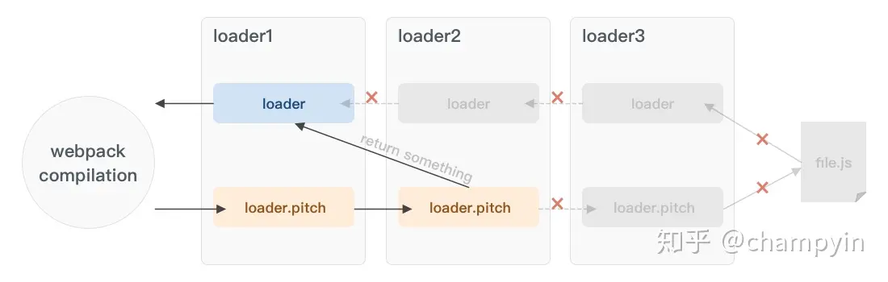

# webpack

本质是一个现代 js 应用程序静态模块打包器，当 webpack 处理应用程序时，会递归的创建一个依赖关系图，包含需要的每个模块，将所有模块打包成一个或多个 bundle。

<!-- require 是运行时调用，import 是编译时调用。   -->
<!-- 编译的时候会使用 babel 把 import 转译成 require。 -->

## module

ESModule，commenJs，AMD，Assets  
`ES6 module` 特点：

- 只能作为模块顶层的语句出现
- import 的模块名只能是字符串常量
- import binding 是 immutable 的

**引入方式**：  
 **`ESModule`**：export，import(import a from 'a' 引入的是 a[default])  
 **`commenJs`**：module.exports，require(import 的是整个 module)

## chunk 和 bundle

**`chunk`**: 打包过程中 modules 的集合
从入口模块开始，引入其他模块...通过引入关系逐个打包，这些 module 就形成了一个 chunk。  
如果有多个入口，会产出多条打包路径，每条路径会形成一个 chunk。  
**`bundle`**：最终输出的一个或多个打包好的文件  
**chunk 和 bundle 的关系**：  
大多数情况 一个 chunk 会产生一个 bundle，但是有例外

```js
module.exports = {
  mode: "production",
  entry: {
    index: "./src/index.js", //入口文件
    //index: ['./src/index.js','./src/add.js']   //多个入口，一个chunk
  },
  /*
  entry:{  //多个chunk
    index: './src/index.js'    
    common:'./src/common.js'
  },
  */
  output: {
    filename: "[name].js", // 输出bundle的文件名
  },
  devtool: "source-map", // 输出源代码
};
```

## 配置

### path 和 publicPath

区别：  
path: 输出文件存放目录，必须是绝对路径（使用 Node.js 的 path 模块）  
publicPath: 读取文件目录，url 相对于 HTML 页面。常用来设置资源请求前缀。

```js
module.exports = {
  output: {
    path: "",
    filename: "[name].bundle.js",
    publicPath: "dist/",
  },
};
```

## loader 和 plugin

**`loader`**：模块转换器。  
webpack 自身只支持 js 和 json 这两种格式的文件。loader 将非 js 模块转化为 webpack 能识别的 js 模块，如将 A.less 转换为 A.css。  
loader 分为：pre,normal,inline,post(执行顺序)  
内联 loader 前缀：!跳过 normal，-!跳过 pre/normal，!!跳过 pre,normal,post loader。  
loader 如果有 pitch 方法，则先按顺序执行 pitch 方法，pitch 如果有返回值，则会打断顺序执行，直接执行该 loader 的前一个 loader，并向前执行。

loader 的执行顺序和配置中的顺序是相反的，即最后一个 loader 最先执行，第一个 loader 最后执行。第一个执行的 loader 接收源文件内容作为参数，其它 loader 接收前一个执行的 loader 的返回值作为参数，最后执行的 loader 会返回此模块的 JavaScript 源码。  
**本质**：将所有类型的文件转换为应用程序的依赖图可直接引用的模块。

**`plugin`**:拓展  
针对 loader 结束后，基于事件机制工作，会监听 webpack 打包过程中的某些节点。
在 webpack 运行的生命周期中会广播出许多事件，plugin 可以监听这些事件，在合适的时机通过 `tapable` 提供的 API 改变输出结果。

**`compliation`**：包含当前模块资源，编译生成资源，webpack 开发模式下运行时，当检测到任意一个文件变化，都会创建一次新的 compliation。

## 打包流程

1. 初始化参数：shell weback.config.js
2. 开始编译：（启动 webpack）：初始化一个 compiler 对象，加载配置，开始执行编译  
   compiler 对象:全局唯一，是 webpack 的实例，包含了 webpack 环境的所有配置信息
3. 确定入口：根据 entry 中的配置，找出所有入口文件
4. 编译模块：从入口文件开始，调用所有 loader，再递归找依赖
5. 完成模块编译：得到每个模块被翻译后的最终内容以及他们之间的关系（依赖图）
6. 输出资源：根据依赖关系组装成一个个包含多个 module 的 chunk
7. 输出完成：根据配置，确定输出的文件名以及路径

## Split Chunks

优化配置

```js
module.exports = {
     mode:'production',
     entry:{
               index: './src/index.js'
                other:'./src/multiply.js'
   },
output:{
filename:"[name].js"  // 输出bundle的文件名
},
  optimization:{         //优化
    runtimeChunk:'single',   // 将模块交互时连接所需的加载和解析逻辑提成一个chunk
    splitChunks:{
      cacheGroups:{
        commons:{       // 公共chunk，如果被至少minChunks个chunk 用到了，就单独提成一个chunk
          chunks:'initial',
          minChunks:2,
          minSize:0   // 达到该大小才提成一个chunk
        },
        vendor:{    // 将第三方包 拆出一个chunk
          test: /node_modules/,   //正则 匹配node_modules下的文件
          chunks:'initial',
          name:'vendor',
          enforce:true
        }
      }
    }
  }
}
```

将外部依赖打成单独的包时，是如何引入的

```js
// 伪代码，隐藏了 moment 和 js-cookie 的代码细节
(window["webpackJsonp"] = window["webpackJsonp"] || []).push([["async"],{
  "./node_modules/js-cookie/src/js.cookie.js": (function(module, exports, __webpack_require__) {}),
  "./node_modules/moment/moment.js": (function(module, exports, __webpack_require__) {})
})
```

## Tree Shaking

用来移除 JavaScript 上下文中的未引用代码(dead-code)，是 DCE 的一种新实现，所有导入文件都会受到 tree shaking 的影响。  
其消除原理依赖于 ES6 的模块特性，ES6 模块依赖关系是确定的，和运行时的状态无关，可以进行可靠的静态分析，这是 tree-shaking 的基础。

### DCE

Dead Code Elimination——消除死代码  
传统编译型的语言中，都是由编译器将 Dead Code 从 AST（抽象语法树）中删除，js 需要压缩工具 uglify 做处理（webpack 自身集成 uglify）。  
Dead Code 一般具有以下几个特征：  
 • 代码不会被执行
• 代码执行的结果不会被用到  
 • 代码只会影响死变量（只写不读）

### 如何配置

#### 条件

1. ES6，用支持 tree-shaking 的方式写代码

```js
// 全部导入 (不支持 tree-shaking)
import _ from "lodash";
// 具名导入(支持 tree-shaking)
import { debounce } from "lodash";
// 直接导入具体的模块 (支持 tree-shaking)
import debounce from "lodash/lib/debounce";
```

2. 处于生产模式，只有在压缩代码的时候会 tree-shaking

#### 配置

1. 标记未引用代码 —— usedExports  
    配置`optimization`选项的`usedExports: true`
   打包结果 js 中未引用的代码会被 unused...注释，
   usedExports 依赖于 terser 去检测语句中的副作用。我们可以通过 `/*#__PURE__*/ `注释来帮忙 terser 标记为没有副作用。如果一个没被使用的变量定义的初始值被认为是无副作用的（pure），它会被标记为死代码，不会被执行且会被压缩工具清除掉(当 `optimization.innerGraph` 被设置成 true 时生效)。

```js
// Base Webpack Config for Tree Shaking
const config = {
 mode: 'production',
 optimization: {
  usedExports: true,
  minimizer: [  // 支持删除死代码的压缩器，识别出 Webpack 是如何标记它认为没有被使用的代码，并将其剥离。
   new TerserPlugin({...})
  ]
 }
};


// 打包结果
/* 1 */
/***/ (function (module, __webpack_exports__, __webpack_require__) {
  "use strict";
  /* unused harmony export square */
  /* harmony export (immutable) */ __webpack_exports__["a"] = cube;
  function square(x) {
    return x * x;
  }

  function cube(x) {
    return x * x * x;
  }
});
```

2. 标记 side-effect-free 文件 —— sideEffects  
   通过 package.json 的 "sideEffects" 属性，声明该包模块是否包含 sideEffects(副作用)，如果被标记为无副作用的模块没有被直接导出使用，打包工具会跳过进行模块的副作用分析评估。

```json
{
  "name": "your-project",
  "sideEffects": false, // 如果所有代码都不包含副作用，我们就可以简单地将该属性标记为 false，来告知 webpack 它可以安全地删除未用到的 export。
  "sideEffects": ["./src/some-side-effectful-file.js", "*.css"]
}
```

> "side effect(副作用)"是，在导入时会执行特殊行为的代码，而不是仅仅暴露一个 export 或多个 export。举例说明，例如 polyfill，它影响全局作用域，并且通常不提供 export。

> 参考：  
> [Webpack 4 Tree Shaking 终极优化指南](https://juejin.cn/post/6844903998634328072)  
> [Tree Shaking](https://webpack.docschina.org/guides/tree-shaking/)

# bundleless

1.拆分 bundle, 可利于 http2 多路复用以及更利于缓存  
2.源代码 no bundle  
3.预打包依赖产物 esbuild、cdn

# Babel

## 执行顺序配置

js 翻译器：解析、转换、生成  
`preset`预设的插件合集：  
低一级的 stage 会包含所有高级 stage 的内容，例如 stage-1 会包含 stage-2, stage-3 的所有内容。
执行顺序：  
plugin、preset；  
plugin 从前往后执行；  
preset 从后往前执行。（为了向后兼容，编排时需注意规范的时间顺序）

```json
{
  "presets": [
    [
      // 带了配置项，自己变成数组
      "env",
      // 第二个元素是对象，列出配置项
      {
        "module": false, //amd, umd, systemjs, commonjs 和 false。这可以让 babel 以特定的模块化格式来输出代码。false 不进行模块化处理。
        "targets": {
          "browsers": ["last 2 versions", "safari >= 7"], // 考虑所有浏览器的最新2个版本(safari大于等于7.0的版本)的特性
          "node": "6.10" // 将目标设置为 nodejs，并且支持 6.10 及以上的版本，也可以node: 'current' 来支持最新稳定版本
        }
      }
    ],
    // 不带配置项，直接列出名字
    "stage-2"
  ]
}
```

## 各种 babel 包

`babel-cli`: devDependencies，编译文件，适用于不需要打包的小小项目  
`babel-register`: devDependencies，对 require 加载的文件进行转码  
`babel-polyfill`: dependencies，对缺失的方法给与支持，用其他方式实现  
缺点：

- 作为一个整体，在原型链上添加方法，使代码冗余 （推荐使用 core-js）
- 污染全局变量（推荐使用 babel-plugin-transform-runtime）

`babel-node`: part of `babel-cli`，直接执行 js。 babel-node = babel-polyfill + babel-register  
`babel-plugin-transform-runtime`: 将替代方法以 require 的方式引入，而不是每次添加。  
`babel-runtime`: 内部集成了

- `core-js`: 类支持
- `regenerator`: core-js 的补丁，如转换 generator/yield 和 async/await
- `helpers`: [babel-helpers](https://github.com/babel/babel/blob/6.x/packages/babel-helpers/src/helpers.js)

`babel-loader`: 用于打包构建
